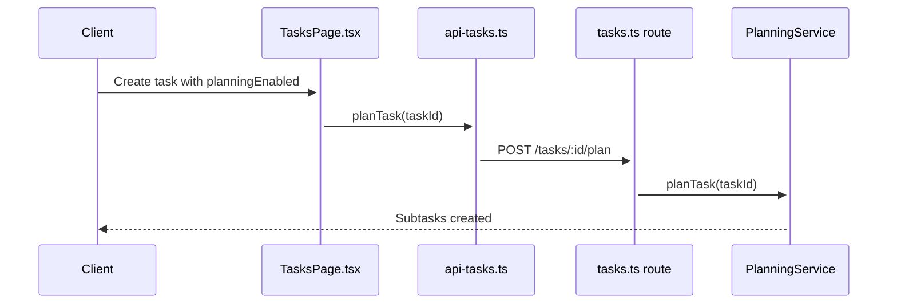
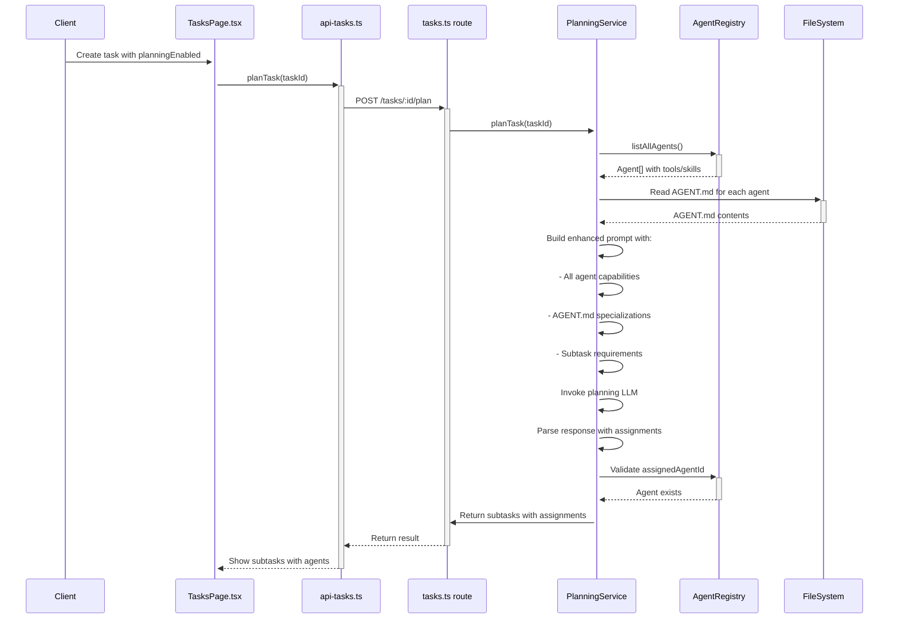

# Plan: AI-Powered Agent Assignment in Planning Mode

## Context

When a task is created with "Enable planning mode" enabled, the planning agent currently decomposes tasks into subtasks without assigning agents. The goal is to have the planning agent:

1. **Read AGENT.md files** from each agent's workspace to understand their specialization
   - Path: `OPENAIDY_HOME/.openaidy/workspaces/{agentId}/AGENT.md`
2. **Read agent capabilities** (tools, skills) from openaidy.json configuration
3. **Automatically assign** the best agent to each subtask based on AI analysis

## Current Architecture



## Target Architecture



## Files to Modify

### 1. `apps/server/src/planning/config.ts`

Add agent assignment fields to `PlannedSubtask`:

```typescript
export type PlannedSubtask = {
  title: string;
  description: string;
  dependencies: number[];
  assignedAgentId?: string; // NEW: Agent recommended for this subtask
  assignmentReason?: string; // NEW: Why this agent was chosen
};
```

### 2. `apps/server/src/planning/prompts.ts`

Add function to build agent context for the planning prompt:

```typescript
import type { AgentSummary } from '../agents/schema';
import fs from 'fs';
import path from 'path';

/**
 * Build the agent context section for the planning prompt
 */
export function buildAgentContextPrompt(
  agents: AgentSummary[],
  openAidyHome: string,
): string {
  const agentProfiles = agents.map((agent) => {
    // Read AGENT.md if exists
    let agentMdContent = '';
    const agentMdPath = path.join(
      openAidyHome,
      '.openaidy',
      'workspaces',
      agent.id,
      'AGENT.md',
    );
    if (fs.existsSync(agentMdPath)) {
      agentMdContent = fs.readFileSync(agentMdPath, 'utf-8');
    }

    return `
## ${agent.name} (${agent.id})
- Description: ${agent.description || 'No description'}
- Tools: ${agent.tools?.join(', ') || 'None'}
- Skills: ${agent.skills?.join(', ') || 'None'}
- MCP Servers: ${agent.mcpServers?.map((m) => m.id).join(', ') || 'None'}
${agentMdContent ? `\nAGENT.md:\n${agentMdContent}` : ''}
`;
  });

  return `Available Agents:
${agentProfiles.join('\n')}

When assigning agents to subtasks, consider:
1. Tool availability - use agents with required tools
2. Skill match - prefer agents with relevant skills
3. Specialization - check AGENT.md for domain expertise
4. Keep workload balanced across agents`;
}

/**
 * Build the planning prompt for a task (enhanced version)
 */
export function buildPlanningPrompt(
  task: Task,
  maxSubtasks: number,
  agentContext?: string,
): string {
  const basePrompt = `Please analyze the following task and break it down into subtasks.

Task Title: ${task.title}

Task Description:
${task.description}`;

  const agentSection = agentContext
    ? `\n\n${agentContext}`
    : '\n\n(No agent context available - assign agents manually)';

  return `${basePrompt}${agentSection}

Requirements:
1. Break down into 1-${maxSubtasks} subtasks — use as FEW as needed
2. Each subtask should be atomic and completable independently
3. Order subtasks logically (dependencies first)
4. Include clear titles and descriptions
5. Specify dependencies between subtasks
6. Assign the best agent for each subtask based on capabilities

Return the subtasks as a JSON array with:
- title: Short, clear title
- description: Detailed description of what needs to be done
- dependencies: Array of subtask indices this depends on (optional)
- assignedAgentId: ID of the agent best suited for this subtask (optional)
- assignmentReason: Brief explanation of why this agent was chosen (optional)`;
}
```

### 3. `apps/server/src/planning/service.ts`

Modify `planTask()` and `createSubtasks()`:

```typescript
// In planTask method, around line 130:

// Build agent context
const agents = this.agents?.listAllAgents() || [];
const agentContext =
  agents.length > 0
    ? buildAgentContextPrompt(agents, process.env.OPENAIDY_HOME || '')
    : undefined;

// Build prompt with agent context
const prompt = buildPlanningPrompt(task, maxSubtasks, agentContext);

// In createSubtasks method, around line 277:
const createdSubtask = await this.subtasksRepo.create({
  taskId,
  ...(parentSubtaskId !== undefined ? { parentSubtaskId } : {}),
  title: subtask.title,
  description: subtask.description,
  orderIndex: i,
  assignedAgentId: subtask.assignedAgentId, // NEW FIELD
});
```

### 4. `apps/server/src/subtasks/store.ts` or repository

Ensure `assignedAgentId` is persisted. Check the subtask creation schema.

### 5. `apps/web/src/components/tasks/SubtaskList.tsx`

Display the assigned agent name:

```tsx
// In SubtaskList.tsx, show agent assignment
<Show when={subtask.assignedAgentId}>
  <span class="text-xs text-purple-600 dark:text-purple-400">
    Assigned: {getAgentName(subtask.assignedAgentId)}
  </span>
</Show>
```

## Implementation Steps

### Step 1: Update Types

- [ ] Modify `PlannedSubtask` in `config.ts` to include `assignedAgentId` and `assignmentReason`
- [ ] Ensure `subtasksRepo.create()` accepts `assignedAgentId` parameter

### Step 2: Build Agent Context

- [ ] Add `buildAgentContextPrompt()` function in `prompts.ts`
- [ ] Handle case where AGENT.md doesn't exist gracefully
- [ ] Format tools, skills, MCP servers clearly

### Step 3: Update Planning Prompt

- [ ] Modify `buildPlanningPrompt()` to accept optional agentContext parameter
- [ ] Add instructions for agent assignment to the prompt

### Step 4: Wire Agent Registry into Planning

- [ ] Pass `AgentRegistry` instance to `PlanningService` (already done via options)
- [ ] Call `listAllAgents()` to get agent capabilities
- [ ] Build agent context before invoking LLM

### Step 5: Validate Assignments

- [ ] In `createSubtasks()`, validate each `assignedAgentId` exists in registry
- [ ] Log warnings for invalid assignments but don't fail

### Step 6: Update Frontend

- [ ] Display assigned agent in `SubtaskList.tsx`
- [ ] Show "unassigned" state when no agent is set

## Optional: Read AGENT.md Files

```typescript
// In prompts.ts or a new utility file
function readAgentDescriptions(
  agentIds: string[],
  openAidyHome: string,
): Map<string, string> {
  const descriptions = new Map<string, string>();

  for (const agentId of agentIds) {
    const agentMdPath = path.join(
      openAidyHome,
      '.openaidy',
      'workspaces',
      agentId,
      'AGENT.md',
    );

    if (fs.existsSync(agentMdPath)) {
      try {
        descriptions.set(agentId, fs.readFileSync(agentMdPath, 'utf-8'));
      } catch {
        // Ignore read errors
      }
    }
  }

  return descriptions;
}
```

## Key Files Summary

| File                  | Changes                                                          |
| --------------------- | ---------------------------------------------------------------- |
| `planning/config.ts`  | Add `assignedAgentId` and `assignmentReason` to `PlannedSubtask` |
| `planning/prompts.ts` | Add `buildAgentContextPrompt()`, update `buildPlanningPrompt()`  |
| `planning/service.ts` | Build agent context, pass to prompt, validate assignments        |
| `subtasks/store.ts`   | Ensure `assignedAgentId` field is persisted                      |
| `SubtaskList.tsx`     | Display assigned agent name                                      |

## Testing Considerations

1. Test with agents that have tools/skills defined
2. Test with agents that don't have AGENT.md files
3. Test assignment when no agents are available
4. Verify subtasks are created with correct `assignedAgentId`
5. Test agent validation (invalid IDs should be ignored, not crash)

## Edge Cases

- **No agents available**: Planning should still work, just without assignments
- **AGENT.md missing**: Use only tools/skills from openaidy.json
- **Invalid assignedAgentId**: Log warning, don't assign, continue planning
- **LLM doesn't assign**: Some subtasks may have no assignment (optional field)
