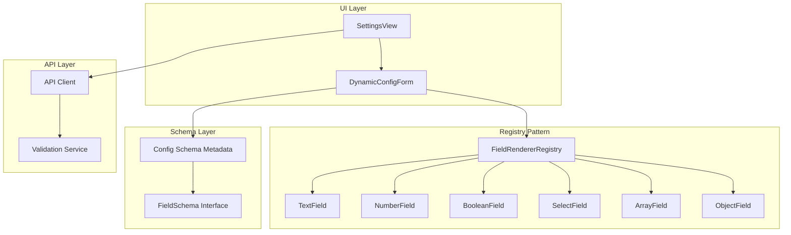

# Dynamic Config Editor Architecture

## Overview

A dynamic form-based config editor that renders fields based on schema metadata, following SOLID principles for maintainability, extensibility, and scalability.

## Current State Analysis

### Problems with Current Implementation

1. **Hardcoded Form Fields** - [`SettingsView.tsx`](apps/web/src/components/SettingsView.tsx) only handles `defaults.providerId` and `defaults.modelId`
2. **Loosely Typed API** - [`api.ts`](apps/web/src/lib/api.ts:233) uses `[key: string]: unknown`
3. **No Extensibility** - Adding new fields requires manual UI changes
4. **Advanced Config Hidden** - Users must switch to Raw JSON for providers/agents

### Existing Schema

The Zod schema in [`packages/config/src/app-config.ts`](packages/config/src/app-config.ts) defines:

- `AppDefaults` - providerId, modelId, agentId
- `AppProviderConfig` - discriminated union by vendorFamily (openai-compatible, anthropic, gemini)
- `AppAgentConfig` - id, name, systemPrompt, defaults, etc.
- `OpenAidyAppConfig` - version, defaults, providers[], agents[]

---

## SOLID Architecture



---

## Component Design

### 1. Schema Metadata Layer

**Single Responsibility:** Define form structure and validation rules separately from UI.

```typescript
// apps/web/src/config/schema.ts

export type FieldType =
  | 'string'
  | 'number'
  | 'boolean'
  | 'select'
  | 'array'
  | 'object'
  | 'discriminated-union';

export type FieldSchema = {
  type: FieldType;
  key: string;
  label: string;
  required?: boolean;
  defaultValue?: unknown;

  // Help and documentation
  description?: string; // Short description shown below label
  helpText?: string; // Longer help text shown in tooltip/popover
  helpUrl?: string; // Link to external documentation
  placeholder?: string; // Placeholder text for input fields

  // For strings
  multiline?: boolean;

  // For numbers
  min?: number;
  max?: number;
  step?: number;

  // For selects
  options?: Array<{ value: string; label: string; description?: string }>;
  optionsSource?: 'providers' | 'agents' | 'models';

  // For arrays
  itemSchema?: FieldSchema;
  minItems?: number;
  maxItems?: number;

  // For objects
  properties?: Record<string, FieldSchema>;

  // For discriminated unions
  discriminator?: string;
  variantSchemas?: Record<string, Record<string, FieldSchema>>;

  // Conditional visibility
  visibleWhen?: VisibilityCondition;

  // Field dependencies - actions to take when this field changes
  effects?: FieldEffect[];
};

/**
 * Conditional visibility - field is shown only when condition is met
 *
 * Examples:
 * - Show apiKeyEnv only when enabled is true
 * - Show anthropic-specific fields only when vendorFamily is anthropic
 */
export type VisibilityCondition =
  | { field: string; equals: unknown }
  | { field: string; notEquals: unknown }
  | { field: string; in: unknown[] }
  | { field: string; notIn: unknown[] }
  | { field: string; exists: boolean }
  | { all: VisibilityCondition[] } // AND - all conditions must be true
  | { any: VisibilityCondition[] } // OR - at least one condition must be true
  | { not: VisibilityCondition }; // NOT - negate the condition

/**
 * Field effects - actions to perform when a field value changes
 *
 * This enables reactive form behavior where changing one field
 * automatically updates other fields.
 */
export type FieldEffect =
  | {
      type: 'setValue';
      target: string;
      value:
        | unknown
        | ((current: unknown, formValues: Record<string, unknown>) => unknown);
    }
  | { type: 'clearValue'; target: string }
  | { type: 'resetToDefault'; target: string }
  | {
      type: 'updateOptions';
      target: string;
      options:
        | Array<{ value: string; label: string }>
        | ((
            formValues: Record<string, unknown>,
          ) => Array<{ value: string; label: string }>);
    }
  | { type: 'validate'; targets: string[] };

export type SectionSchema = {
  id: string;
  title: string;
  description?: string;
  fields: FieldSchema[];
};
```

### 2. Field Renderer Registry

**Open/Closed Principle:** New field types can be added without modifying existing code.

```typescript
// apps/web/src/config/field-renderers/types.ts

export type FieldRendererProps<T> = {
  value: T | undefined;
  onChange: (value: T) => void;
  schema: FieldSchema;
  error?: string;
  disabled?: boolean;
};

export type FieldRenderer<T> = (props: FieldRendererProps<T>) => JSX.Element;

// apps/web/src/config/field-renderers/registry.ts

export type FieldRendererRegistry = {
  register: (type: FieldType, renderer: FieldRenderer<unknown>) => void;
  get: (type: FieldType) => FieldRenderer<unknown> | undefined;
  has: (type: FieldType) => boolean;
};

export function createFieldRendererRegistry(): FieldRendererRegistry {
  const renderers = new Map<FieldType, FieldRenderer<unknown>>();

  return {
    register: (type, renderer) => renderers.set(type, renderer),
    get: (type) => renderers.get(type),
    has: (type) => renderers.has(type),
  };
}
```

### 3. Field Label Component

All field renderers use a shared `FieldLabel` component for consistent labeling and help display:

```typescript
// apps/web/src/config/field-renderers/FieldLabel.tsx

export type FieldLabelProps = {
  schema: FieldSchema;
  required?: boolean;
  error?: string;
};

export function FieldLabel(props: FieldLabelProps) {
  const { schema } = props;
  const [showHelp, setShowHelp] = createSignal(false);

  return (
    <div class="field-label-container">
      {/* Label row with required indicator and help button */}
      <div class="flex items-center gap-2 mb-1">
        <label class="block text-sm font-medium text-gray-700 dark:text-gray-300">
          {schema.label}
          {schema.required && <span class="text-red-500 ml-1">*</span>}
        </label>

        {/* Help icon button for tooltip/popover */}
        <Show when={schema.helpText || schema.helpUrl}>
          <button
            type="button"
            onClick={() => setShowHelp(!showHelp())}
            class="text-gray-400 hover:text-gray-600 dark:hover:text-gray-300"
          >
            <HelpCircle class="w-4 h-4" />
          </button>
        </Show>
      </div>

      {/* Short description below label */}
      <Show when={schema.description}>
        <p class="text-xs text-gray-500 dark:text-gray-400 mb-2">
          {schema.description}
        </p>
      </Show>

      {/* Expandable help text */}
      <Show when={showHelp() && schema.helpText}>
        <div class="text-sm text-gray-600 dark:text-gray-300 bg-gray-50 dark:bg-gray-800 p-3 rounded-lg mb-2">
          {schema.helpText}
          <Show when={schema.helpUrl}>
            <a
              href={schema.helpUrl}
              target="_blank"
              rel="noopener noreferrer"
              class="text-blue-500 hover:text-blue-600 ml-1"
            >
              Learn more →
            </a>
          </Show>
        </div>
      </Show>

      {/* Validation error */}
      <Show when={props.error}>
        <p class="text-xs text-red-500 mt-1">{props.error}</p>
      </Show>
    </div>
  );
}
```

### 4. Individual Field Renderers

**Liskov Substitution Principle:** All renderers are interchangeable through the common interface.

**Interface Segregation Principle:** Each renderer only implements what it needs.

```typescript
// apps/web/src/config/field-renderers/TextField.tsx
export function TextField(props: FieldRendererProps<string>) {
  return (
    <div class="field-container">
      <FieldLabel schema={props.schema} error={props.error} />
      <input
        type="text"
        value={props.value ?? ''}
        onInput={(e) => props.onChange(e.currentTarget.value)}
        placeholder={props.schema.placeholder}
        disabled={props.disabled}
        class="w-full bg-gray-50 dark:bg-gray-900 border border-gray-300 dark:border-gray-700 rounded-lg px-3 py-2"
      />
    </div>
  );
}

// apps/web/src/config/field-renderers/NumberField.tsx
export function NumberField(props: FieldRendererProps<number>) {
  // ... render with min/max/step support
}

// apps/web/src/config/field-renderers/SelectField.tsx
export function SelectField(props: FieldRendererProps<string>) {
  // ... render with options or optionsSource resolution
}

// apps/web/src/config/field-renderers/ArrayField.tsx
export function ArrayField(props: FieldRendererProps<unknown[]>) {
  // ... render with add/remove/reorder items
}

// apps/web/src/config/field-renderers/ObjectField.tsx
export function ObjectField(props: FieldRendererProps<Record<string, unknown>>) {
  // ... recursively render nested fields
}
```

### 4. Dynamic Config Form

**Dependency Inversion Principle:** High-level form depends on abstractions (registry), not concrete implementations.

```typescript
// apps/web/src/config/DynamicConfigForm.tsx

export type DynamicConfigFormProps = {
  config: AppConfig;
  schema: SectionSchema[];
  onChange: (config: AppConfig) => void;
  errors?: Record<string, string>;
  registry: FieldRendererRegistry;
};

export function DynamicConfigForm(props: DynamicConfigFormProps) {
  // Recursively render sections and fields based on schema
  // Check visibleWhen conditions before rendering each field
  // Delegate to registry for field rendering
}

// apps/web/src/config/visibility.ts

/**
 * Evaluates visibility conditions against current form values
 * Supports nested field paths using dot notation
 */
export function evaluateVisibility(
  condition: VisibilityCondition,
  values: Record<string, unknown>,
): boolean {
  // Get nested field value using dot notation (e.g., "defaults.providerId")
  const getFieldValue = (path: string): unknown => {
    const parts = path.split('.');
    let current: unknown = values;
    for (const part of parts) {
      if (current === null || current === undefined) return undefined;
      current = (current as Record<string, unknown>)[part];
    }
    return current;
  };

  if ('equals' in condition) {
    return getFieldValue(condition.field) === condition.equals;
  }
  if ('notEquals' in condition) {
    return getFieldValue(condition.field) !== condition.notEquals;
  }
  if ('in' in condition) {
    return condition.in.includes(getFieldValue(condition.field));
  }
  if ('notIn' in condition) {
    return !condition.notIn.includes(getFieldValue(condition.field));
  }
  if ('exists' in condition) {
    const value = getFieldValue(condition.field);
    return condition.exists ? value !== undefined : value === undefined;
  }
  if ('all' in condition) {
    return condition.all.every((c) => evaluateVisibility(c, values));
  }
  if ('any' in condition) {
    return condition.any.some((c) => evaluateVisibility(c, values));
  }
  if ('not' in condition) {
    return !evaluateVisibility(condition.not, values);
  }
  return true;
}
```

### 5. Conditional Visibility Examples

```typescript
// Example: Provider config with descriptions and help text
const providerSchema: FieldSchema = {
  type: 'object',
  key: 'providers',
  properties: {
    id: {
      type: 'string',
      key: 'id',
      label: 'Provider ID',
      required: true,
      description: 'Unique identifier for this provider',
      placeholder: 'e.g., openai, anthropic',
      helpText:
        'The ID is used to reference this provider in agents and defaults. Use lowercase letters, numbers, and hyphens.',
    },
    enabled: {
      type: 'boolean',
      key: 'enabled',
      label: 'Enabled',
      defaultValue: true,
      description: 'Enable or disable this provider',
      helpText: 'Disabled providers are ignored during provider selection.',
    },
    apiKeyEnv: {
      type: 'string',
      key: 'apiKeyEnv',
      label: 'API Key Environment Variable',
      description: 'Name of the environment variable containing the API key',
      placeholder: 'e.g., OPENAI_API_KEY',
      helpText:
        'The app will read the API key from this environment variable at runtime. Never hardcode API keys in the config file.',
      helpUrl: 'https://platform.openai.com/docs/api-keys',
      // Only show when enabled is true
      visibleWhen: { field: 'enabled', equals: true },
    },
    vendorFamily: {
      type: 'select',
      key: 'vendorFamily',
      label: 'Vendor Family',
      options: [
        { value: 'openai-compatible', label: 'OpenAI Compatible' },
        { value: 'anthropic', label: 'Anthropic' },
        { value: 'gemini', label: 'Google Gemini' },
      ],
    },
    // Anthropic-specific field
    apiVersion: {
      type: 'string',
      key: 'apiVersion',
      label: 'API Version',
      defaultValue: '2023-06-01',
      visibleWhen: { field: 'vendorFamily', equals: 'anthropic' },
    },
    // Gemini-specific field
    projectId: {
      type: 'string',
      key: 'projectId',
      label: 'Google Cloud Project ID',
      visibleWhen: { field: 'vendorFamily', equals: 'gemini' },
    },
    // Complex condition: show for OpenAI or Anthropic
    enableStreaming: {
      type: 'boolean',
      key: 'enableStreaming',
      label: 'Enable Streaming',
      defaultValue: true,
      visibleWhen: {
        any: [
          { field: 'vendorFamily', equals: 'openai-compatible' },
          { field: 'vendorFamily', equals: 'anthropic' },
        ],
      },
    },
  },
};
```

### 6. Field Effects Processor

```typescript
// apps/web/src/config/effects.ts

/**
 * Processes field effects when a value changes
 * Returns a partial config with the effects applied
 */
export function processFieldEffects(
  changedField: string,
  newValue: unknown,
  currentConfig: Record<string, unknown>,
  fieldSchemas: Record<string, FieldSchema>,
): Partial<Record<string, unknown>> {
  const schema = fieldSchemas[changedField];
  if (!schema?.effects) return {};

  const updates: Partial<Record<string, unknown>> = {};

  for (const effect of schema.effects) {
    switch (effect.type) {
      case 'setValue': {
        const value =
          typeof effect.value === 'function'
            ? effect.value(newValue, currentConfig)
            : effect.value;
        setNestedValue(updates, effect.target, value);
        break;
      }
      case 'clearValue': {
        setNestedValue(updates, effect.target, undefined);
        break;
      }
      case 'resetToDefault': {
        const targetSchema = fieldSchemas[effect.target];
        if (targetSchema?.defaultValue !== undefined) {
          setNestedValue(updates, effect.target, targetSchema.defaultValue);
        }
        break;
      }
      case 'updateOptions': {
        // This would be handled by the form state to update dynamic options
        // Not a config value change, but a UI state change
        break;
      }
      case 'validate': {
        // Trigger validation for specified targets
        // Handled by the validation system
        break;
      }
    }
  }

  return updates;
}

// Helper to set nested values using dot notation
function setNestedValue(
  obj: Record<string, unknown>,
  path: string,
  value: unknown,
): void {
  const parts = path.split('.');
  let current = obj;
  for (let i = 0; i < parts.length - 1; i++) {
    if (!(parts[i] in current)) {
      current[parts[i]] = {};
    }
    current = current[parts[i]] as Record<string, unknown>;
  }
  current[parts[parts.length - 1]] = value;
}
```

### 7. Field Effects Examples

```typescript
// Example: Provider selection affects model options
const defaultsSchema: FieldSchema = {
  type: 'object',
  key: 'defaults',
  properties: {
    providerId: {
      type: 'select',
      key: 'providerId',
      label: 'Default Provider',
      optionsSource: 'providers',
      effects: [
        // When provider changes, update model options to that provider's models
        {
          type: 'updateOptions',
          target: 'modelId',
          options: (formValues) => {
            const providers = formValues.providers as Provider[];
            const selectedProvider = providers?.find(
              (p) => p.id === formValues.defaults?.providerId,
            );
            return (
              selectedProvider?.models?.map((m) => ({
                value: m.id,
                label: m.name,
              })) || []
            );
          },
        },
        // Reset model to first available from new provider
        {
          type: 'setValue',
          target: 'modelId',
          value: (newValue, formValues) => {
            const providers = formValues.providers as Provider[];
            const provider = providers?.find((p) => p.id === newValue);
            return provider?.defaultModel || provider?.models?.[0]?.id || '';
          },
        },
      ],
    },
    modelId: {
      type: 'select',
      key: 'modelId',
      label: 'Default Model',
      options: [], // Populated dynamically by providerId effect
    },
  },
};

// Example: Vendor family change resets vendor-specific fields
const providerSchema: FieldSchema = {
  type: 'object',
  key: 'providers',
  properties: {
    vendorFamily: {
      type: 'select',
      key: 'vendorFamily',
      label: 'Vendor Family',
      options: [
        { value: 'openai-compatible', label: 'OpenAI Compatible' },
        { value: 'anthropic', label: 'Anthropic' },
        { value: 'gemini', label: 'Google Gemini' },
      ],
      effects: [
        // Clear vendor-specific fields when vendor changes
        { type: 'clearValue', target: 'apiVersion' },
        { type: 'clearValue', target: 'projectId' },
        { type: 'clearValue', target: 'useVertexAI' },
        // Reset common fields to vendor-appropriate defaults
        {
          type: 'setValue',
          target: 'defaultMaxTokens',
          value: (newValue) => {
            if (newValue === 'gemini') return 8192;
            if (newValue === 'anthropic') return 4096;
            return 4096; // openai-compatible
          },
        },
      ],
    },
  },
};

// Example: Enabling/disabling a provider clears API key if disabled
const enabledSchema: FieldSchema = {
  type: 'boolean',
  key: 'enabled',
  label: 'Enabled',
  defaultValue: true,
  effects: [
    {
      type: 'clearValue',
      target: 'apiKeyEnv',
      // Only clear if being disabled, not enabled
      // This would need conditional effect support
    },
  ],
};
```

---

## File Structure

```
apps/web/src/config/
├── index.ts                    # Public exports
├── schema.ts                   # FieldSchema types and config schema definitions
├── visibility.ts               # VisibilityCondition evaluation logic
├── effects.ts                  # FieldEffect processing logic
├── defaults-schema.ts          # Schema for defaults section
├── providers-schema.ts         # Schema for providers array
├── agents-schema.ts            # Schema for agents array
├── field-renderers/
│   ├── index.ts                # Export all renderers
│   ├── types.ts                # FieldRendererProps, FieldRenderer types
│   ├── registry.ts             # FieldRendererRegistry implementation
│   ├── TextField.tsx
│   ├── NumberField.tsx
│   ├── BooleanField.tsx
│   ├── SelectField.tsx
│   ├── ArrayField.tsx
│   ├── ObjectField.tsx
│   └── DiscriminatedUnionField.tsx
├── DynamicConfigForm.tsx       # Main form component
├── ConfigSection.tsx           # Section wrapper with collapse/expand
└── useConfigValidation.ts      # Validation hook
```

---

## Implementation Plan

### Phase 1: Foundation

1. Create `FieldSchema` types and interfaces
2. Implement `FieldRendererRegistry`
3. Create basic field renderers (Text, Number, Boolean, Select)

### Phase 2: Complex Fields

4. Implement `ArrayField` with add/remove/reorder
5. Implement `ObjectField` with recursive rendering
6. Implement `DiscriminatedUnionField` for provider variants

### Phase 3: Schema Definition

7. Define schema for `defaults` section
8. Define schema for `providers` array
9. Define schema for `agents` array

### Phase 4: Integration

10. Create `DynamicConfigForm` component
11. Update `api.ts` with proper types from server
12. Refactor `SettingsView` to use dynamic form

### Phase 5: Polish

13. Add validation error display
14. Add loading/saving states
15. Add undo/redo support (optional)

---

## Benefits

| Principle                 | How It's Applied                                              |
| ------------------------- | ------------------------------------------------------------- |
| **S**ingle Responsibility | Each renderer handles one field type; schema separate from UI |
| **O**pen/Closed           | Add new field types by registering renderers; no core changes |
| **L**iskov Substitution   | All renderers interchangeable via common interface            |
| **I**nterface Segregation | Renderers only implement props they need                      |
| **D**ependency Inversion  | Form depends on registry abstraction, not concrete renderers  |

### Scalability

- **Schema changes:** Update schema definition, UI updates automatically
- **New field types:** Register new renderer, reference in schema
- **New sections:** Add to schema array, form renders it

### Maintainability

- **Clear separation:** Schema → Registry → Renderers → Form
- **Type safety:** TypeScript ensures schema/value consistency
- **Testable:** Each layer can be unit tested in isolation
