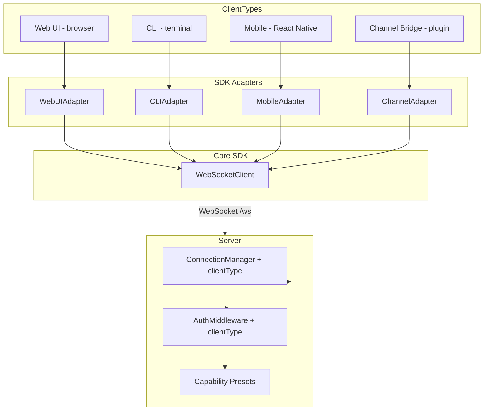
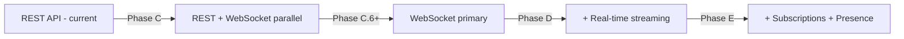

# Multi-Client Support Plan

## Overview

Implement multi-client type support for the WebSocket control plane, focusing on:

1. Adding `clientType` awareness throughout the server and shared types
2. Creating client adapter interfaces in the SDK for all client types
3. Migrating the Web UI from REST polling to WebSocket real-time communication
4. Providing reference implementations for each adapter

## Current State (Updated: 2026-04-04)

| Client Type        | Status      | Details                                             |
| ------------------ | ----------- | --------------------------------------------------- |
| **CLI**            | ✅ Working  | Uses `WebSocketClient` via `connectToServer()`      |
| **Web UI**         | ✅ Complete | WebSocket streaming, real-time, presence indicators |
| **Mobile**         | ✅ Complete | MobileAdapter implemented                           |
| **Channel Bridge** | ✅ Complete | ChannelAdapter implemented                          |

### Implementation Complete ✅

All phases A-F have been implemented:

1. **Phase A: ClientType awareness** - Complete
2. **Phase B: Adapter interfaces** - Complete
3. **Phase C: Web UI migration** - Complete
4. **Phase D: Capability presets** - Complete
5. **Phase E: Subscriptions** - Complete
6. **Phase E: Presence UI** - Complete

### Key Gaps

1. **No `clientType` field** — `ConnectionContext` and `AuthAuthenticateRequest` have no client type awareness
2. **Web UI uses REST polling** — `App.tsx` uses `@tanstack/solid-query` with REST `fetch()` calls
3. **No adapter interfaces** — SDK has one generic `WebSocketClient` with no specialization per client type
4. **No capability presets** — Server doesn't auto-assign capability sets based on client type

## Architecture



## Phase A: Add clientType Awareness to Shared Types and Server

### A.1: Add `ClientType` to shared types

**File:** `packages/shared-types/src/websocket.ts`

Add a `ClientType` enum and include it in the auth request:

```typescript
export type ClientType = 'web' | 'cli' | 'mobile' | 'channel';

// Update AuthAuthenticateRequest payload to include:
// clientType: ClientType;
// clientVersion?: string;  // e.g., "1.0.0"
// clientMeta?: Record<string, unknown>;  // OS, browser, etc.
```

Also update `AuthAuthenticatedResponse` to echo back the confirmed `clientType`.

### A.2: Add `clientType` to `ConnectionContext`

**File:** `apps/server/src/websocket/connection-manager.ts`

Add to `ConnectionContext`:

```typescript
clientType?: ClientType;
clientVersion?: string;
```

Update `authenticate()` to accept and store `clientType`.

### A.3: Add `clientType` to auth middleware

**File:** `apps/server/src/websocket/middleware/auth.ts`

Update `AuthResult` to include `clientType`. When validating tokens, extract and propagate `clientType` from the JWT claims or from the auth request payload.

### A.4: Add capability presets per client type

**File:** `apps/server/src/websocket/middleware/auth.ts` (or new file `capability-presets.ts`)

```typescript
const CAPABILITY_PRESETS: Record<ClientType, string[]> = {
  web: [
    'sessions.read',
    'sessions.write',
    'sessions.stream',
    'sessions.delete',
    'agents.read',
    'agents.invoke',
    'providers.read',
    'config.read',
    'system.notify',
  ],
  cli: [
    'sessions.read',
    'sessions.write',
    'sessions.stream',
    'sessions.delete',
    'agents.read',
    'agents.invoke',
    'providers.read',
    'providers.invoke',
    'config.read',
    'config.write',
    'node.invoke',
    'node.describe',
    'pairing.approve',
    'pairing.deny',
    'system.run',
    'system.notify',
  ],
  mobile: [
    'sessions.read',
    'sessions.write',
    'sessions.stream',
    'agents.read',
    'agents.invoke',
    'providers.read',
    'config.read',
    'node.invoke',
    'system.notify',
  ],
  channel: [
    'sessions.read',
    'sessions.write',
    'sessions.stream',
    'agents.read',
    'agents.invoke',
    'providers.read',
    'providers.invoke',
    'system.notify',
  ],
};
```

When a client authenticates with a `clientType`, the server applies the corresponding preset unless the token already specifies scopes.

### A.5: Update auth handler in gateway

**File:** `apps/server/src/websocket/index.ts`

Update the `auth.authenticate` handler to:

1. Read `clientType` from the request payload
2. Pass it to `ConnectionManager.authenticate()`
3. Apply capability presets
4. Include `clientType` in the JWT claims for re-authentication

### A.6: Update shared-types exports

**File:** `packages/shared-types/src/index.ts`

Export the new `ClientType` and updated types.

---

## Phase B: Create Client Adapter Interfaces in SDK

### B.1: Define `ClientAdapter` interface

**File:** `packages/sdk/src/adapters/types.ts` (new)

```typescript
import type { ClientType } from '@openaidy/shared-types';
import type { WebSocketClient } from '../websocket-client.js';

/**
 * Base interface for all client type adapters.
 * Each adapter customizes the WebSocket client for its platform.
 */
export interface ClientAdapter<TOptions = Record<string, unknown>> {
  /** The client type identifier */
  readonly clientType: ClientType;

  /** Create a configured WebSocketClient for this client type */
  createClient(options: TOptions): WebSocketClient;

  /** Get default capabilities for this client type */
  getDefaultCapabilities(): string[];

  /** Get the WebSocket URL for this client type */
  resolveUrl(baseUrl: string): string;

  /** Platform-specific connection setup */
  onConnect(client: WebSocketClient): Promise<void>;

  /** Platform-specific cleanup */
  onDisconnect(client: WebSocketClient): Promise<void>;
}
```

### B.2: Create `WebUIAdapter`

**File:** `packages/sdk/src/adapters/web-ui.ts` (new)

Reference implementation for browser-based clients:

- Uses browser `WebSocket` API
- Default URL from `window.location`
- Auto-subscribes to session events on connect
- Handles presence updates on visibility change
- Manages reconnection with browser-specific considerations

### B.3: Create `CLIAdapter`

**File:** `packages/sdk/src/adapters/cli.ts` (new)

Adapter for terminal/CLI clients:

- Reads token from file system
- Uses configured server URL
- No auto-subscriptions
- Supports admin-level capabilities

### B.4: Create `MobileAdapter`

**File:** `packages/sdk/src/adapters/mobile.ts` (new)

Interface for React Native / mobile clients:

- Accepts custom WebSocket implementation for React Native
- Handles app backgrounding/foregrounding
- Push notification integration hooks
- Reduced capability set

### B.5: Create `ChannelAdapter`

**File:** `packages/sdk/src/adapters/channel.ts` (new)

Interface for channel bridge plugins:

- Message format translation hooks
- Channel-specific event routing
- Webhook fallback support
- Service-level authentication

### B.6: Export adapters from SDK

**File:** `packages/sdk/src/index.ts`

Add exports for all adapter types and implementations.

---

## Phase C: Web UI WebSocket Migration — Replace REST with Real-Time

### C.1: Create WebSocket-backed API layer

**File:** `apps/web/src/lib/ws-api.ts` (new)

Create a new API module that mirrors the existing `api.ts` functions but uses WebSocket under the hood:

```typescript
// Mirrors existing REST functions but via WebSocket
export function listSessions(): Promise<{ items: Session[] }>;
export function createSession(title: string): Promise<Session>;
export function getSession(id: string): Promise<Session>;
export function listMessages(
  sessionId: string,
): Promise<{ items: SessionMessage[] }>;
export function submitMessage(
  sessionId: string,
  input: SubmitMessageInput,
): Promise<SubmitMessageResult>;
export function listAgents(): Promise<{ items: Agent[] }>;
export function listRuns(sessionId: string): Promise<{ items: SessionRun[] }>;
```

Each function:

1. Sends the corresponding WebSocket message (e.g., `session.list`)
2. Returns a Promise that resolves with the response payload
3. Uses the `RequestCorrelator` pattern from the SDK

### C.2: Create WebSocket provider component

**File:** `apps/web/src/lib/ws-provider.tsx` (new)

SolidJS context provider that:

1. Initializes `WebUIAdapter` + `WebSocketClient` on mount
2. Authenticates using a token obtained from the server
3. Provides the client to child components via context
4. Handles connection state (connected, reconnecting, error)
5. Manages lifecycle (connect on mount, disconnect on unmount)

### C.3: Create `useWebSocket` hook

**File:** `apps/web/src/lib/use-websocket.ts` (new)

SolidJS primitive that:

1. Accesses the WebSocket client from context
2. Exposes connection state reactively
3. Provides methods for sending requests
4. Auto-reconnects on connection loss

### C.4: Create streaming hooks

**File:** `apps/web/src/lib/use-streaming.ts` (new)

```typescript
export function useSessionStream(sessionId: string) {
  // Returns reactive signals:
  // - isStreaming: boolean
  // - content: string (accumulated)
  // - deltas: string[] (incremental)
  // - usage: UsageInfo | null
  // - error: Error | null
}
```

### C.5: Update `App.tsx` to use WebSocket provider

**File:** `apps/web/src/App.tsx`

Wrap the app with the WebSocket provider. Initially, keep REST calls working alongside WebSocket so we can migrate incrementally.

### C.6: Migrate session list to WebSocket

**File:** `apps/web/src/App.tsx`

Replace `listSessions` REST call with WebSocket-backed version. Add real-time updates via session subscription.

### C.7: Migrate message submission to WebSocket

**File:** `apps/web/src/App.tsx` and `apps/web/src/components/ChatComposer.tsx`

Replace `submitMessage` REST call with WebSocket `session.message`. Enable streaming responses.

---

## Phase D: Add Real-Time Streaming to Web UI Chat View

### D.1: Update `ChatView` for streaming

**File:** `apps/web/src/components/ChatView.tsx`

- Show streaming indicator while response is in progress
- Render content incrementally as deltas arrive
- Display tool calls in real-time
- Show usage stats when stream completes

### D.2: Create streaming message component

**File:** `apps/web/src/components/StreamingMessage.tsx` (new)

A SolidJS component that:

- Renders markdown content as it streams in
- Shows a blinking cursor during streaming
- Animates the appearance of new content
- Handles code blocks, lists, and other markdown features

### D.3: Update message list for real-time

**File:** `apps/web/src/components/ChatView.tsx`

- Auto-scroll to bottom as new deltas arrive
- Show "typing" indicator when assistant is processing
- Append streamed content to the message list in real-time
- Handle stream errors gracefully

---

## Phase E: Add Session Subscriptions and Presence to Web UI

### E.1: Create subscription manager for Web UI

**File:** `apps/web/src/lib/subscriptions.ts` (new)

Manages active subscriptions:

- Auto-subscribe to selected session
- Unsubscribe when switching sessions
- Re-subscribe after reconnection
- Handle subscription errors

### E.2: Add presence indicator

**File:** `apps/web/src/components/PresenceIndicator.tsx` (new)

Shows:

- Online/presence status of connected clients
- Number of active viewers on a session
- Client type icons (web, CLI, mobile)

### E.3: Add connection status indicator

**File:** `apps/web/src/components/ConnectionStatus.tsx` (new)

Shows:

- WebSocket connection state (connected, reconnecting, disconnected)
- Last heartbeat timestamp
- Reconnect button

### E.4: Wire up real-time session events

**File:** `apps/web/src/App.tsx`

When subscribed to a session:

- `session.created` → Add to session list
- `session.deleted` → Remove from session list
- `session.updated` → Update session metadata
- `session.message` → Append to message list (non-streaming)

---

## Phase F: Tests

### F.1: Test clientType in shared types

**File:** `packages/shared-types/src/websocket.test.ts`

- Test `ClientType` values
- Test `AuthAuthenticateRequest` with `clientType`
- Test `AuthAuthenticatedResponse` with `clientType`

### F.2: Test connection manager clientType tracking

**File:** `apps/server/src/websocket/connection-manager.test.ts`

- Test `authenticate()` stores `clientType`
- Test `getByClientType()` returns correct connections
- Test capability presets applied per client type

### F.3: Test auth middleware with clientType

**File:** `apps/server/src/websocket/middleware/auth.test.ts`

- Test JWT includes `clientType` claim
- Test capability preset application
- Test token refresh preserves `clientType`

### F.4: Test WebUI adapter

**File:** `packages/sdk/src/adapters/web-ui.test.ts`

- Test adapter creates client with correct type
- Test default capabilities
- Test URL resolution
- Test connect/disconnect lifecycle

### F.5: Test CLI adapter

**File:** `packages/sdk/src/adapters/cli.test.ts`

- Test adapter creates client with correct type
- Test admin capabilities
- Test token file reading

### F.6: Test ws-api layer

**File:** `apps/web/src/lib/ws-api.test.ts`

- Test each API function sends correct WebSocket message
- Test response correlation
- Test error handling

### F.7: Test streaming hooks

**File:** `apps/web/src/lib/use-streaming.test.ts`

- Test delta accumulation
- Test stream start/end lifecycle
- Test error handling during stream

---

## File Structure

```
packages/shared-types/src/
├── websocket.ts                    # Updated: add ClientType, update auth types
└── index.ts                        # Updated: export ClientType

packages/sdk/src/
├── index.ts                        # Updated: export adapters
├── websocket-client.ts             # Unchanged
├── websocket-client.types.ts       # Unchanged
└── adapters/                       # NEW
    ├── types.ts                    # ClientAdapter interface
    ├── web-ui.ts                   # WebUIAdapter (reference impl)
    ├── web-ui.test.ts
    ├── cli.ts                      # CLIAdapter (reference impl)
    ├── cli.test.ts
    ├── mobile.ts                   # MobileAdapter (interface + stubs)
    ├── channel.ts                  # ChannelAdapter (interface + stubs)
    └── index.ts                    # Barrel export

apps/server/src/websocket/
├── connection-manager.ts           # Updated: add clientType to ConnectionContext
├── middleware/
│   └── auth.ts                     # Updated: clientType in auth flow, presets
├── index.ts                        # Updated: clientType in auth handler
└── capability-presets.ts           # NEW: capability presets per client type

apps/web/src/
├── App.tsx                         # Updated: WebSocket provider, migrate queries
├── lib/
│   ├── api.ts                      # KEPT for fallback / non-WS operations
│   ├── ws-api.ts                   # NEW: WebSocket-backed API functions
│   ├── ws-provider.tsx             # NEW: SolidJS WebSocket context provider
│   ├── use-websocket.ts            # NEW: useWebSocket primitive
│   ├── use-streaming.ts            # NEW: useSessionStream primitive
│   └── subscriptions.ts           # NEW: subscription manager
└── components/
    ├── ChatView.tsx                # Updated: streaming support
    ├── StreamingMessage.tsx        # NEW: streaming message renderer
    ├── ConnectionStatus.tsx        # NEW: WS connection indicator
    └── PresenceIndicator.tsx       # NEW: presence display
```

## Migration Strategy

The Web UI migration follows an incremental approach:

1. **Phase C** adds the WebSocket infrastructure alongside existing REST — nothing breaks
2. **Phase C.6-C.7** swaps individual API calls from REST to WebSocket one at a time
3. **Phase D** adds streaming which is entirely new functionality (no REST equivalent)
4. **Phase E** adds subscriptions/presence which is also entirely new
5. REST `api.ts` is kept as fallback for non-WebSocket scenarios



## Out of Scope - Future Work

- **Mobile SDK**: Full React Native adapter implementation
- **Channel Bridge**: Full plugin framework with message translation
- **Offline support**: Service worker caching for WebSocket messages
- **Authentication UI**: Login/token management in Web UI (currently relies on server-side auth)
- **Multi-tab sync**: Broadcasting WebSocket events across browser tabs

---

## Environment Configuration

### Required Environment Variables

#### Server (.env)

| Variable       | Required | Description                    |
| -------------- | -------- | ------------------------------ |
| `PORT`         | Yes      | Server port (default: 3001)    |
| `DATABASE_URL` | Yes      | SQLite database path           |
| `JWT_SECRET`   | Yes      | JWT signing secret             |
| `WS_TOKEN`     | No       | WebSocket authentication token |

#### Web Client (.env)

| Variable           | Required | Description        |
| ------------------ | -------- | ------------------ |
| `VITE_API_URL`     | No       | REST API base URL  |
| `VITE_WS_TOKEN`    | No       | WebSocket token    |
| `VITE_APP_VERSION` | No       | App version string |

#### CLI

| Variable              | Required | Description                                 |
| --------------------- | -------- | ------------------------------------------- |
| `OPENAI_API_KEY`      | Yes      | OpenAI API key                              |
| `OPENAIDY_SERVER_URL` | No       | Server URL (default: http://localhost:3001) |

### Local Development Setup

```bash
# Install dependencies
pnpm install

# Start development server
cd apps/server && pnpm dev

# Start web client (separate terminal)
cd apps/web && pnpm dev

# Start CLI
cd packages/cli && pnpm start
```

---

## Troubleshooting Guide

### Common Issues

#### 1. WebSocket Connection Fails

**Symptoms:** Connection status shows "error" or "disconnected"

**Diagnosis:**

```bash
# Check server is running
curl http://localhost:3001/health

# Check WebSocket endpoint
curl -i -N \
  -H "Connection: Upgrade" \
  -H "Upgrade: websocket" \
  http://localhost:3001/ws
```

**Solutions:**

- Verify server is running on correct port
- Check `WS_TOKEN` is set if required
- Check browser console for CORS errors

#### 2. Capability Denied

**Symptoms:** "Capability denied" error in server logs

**Diagnosis:**

```bash
# Check capability presets
grep -r "capability" apps/server/src/websocket/capability-presets.ts
```

**Solutions:**

- Ensure client sends correct `clientType`
- Verify capability preset exists for your client type

#### 3. REST Fallback Issues

**Symptoms:** Web client falls back to REST but doesn't work

**Diagnosis:**

- Check network tab for failed WebSocket upgrade
- Check server REST endpoints respond

**Solutions:**

- Start server with `pnpm dev`
- Verify `VITE_API_URL` points to correct server

#### 4. Reconnection Issues

**Symptoms:** Client reconnects repeatedly or fails to reconnect

**Diagnosis:**

- Check browser console for reconnection logs
- Check server `checkStaleConnections` timeout

**Solutions:**

- Verify heartbeat is enabled
- Check server logs for connection cleanup

---

## Verification Commands

### Run All Tests

```bash
# Root level - all packages
pnpm test

# Individual packages
cd apps/server && pnpm test
cd apps/web && pnpm test
cd packages/sdk && pnpm test
```

### Build Verification

```bash
# Build all packages
pnpm build

# Individual builds
cd apps/server && pnpm build
cd apps/web && pnpm build
cd packages/sdk && pnpm build
```

### Integration Tests

```bash
# Server E2E tests
cd apps/server && pnpm test:e2e

# SDK adapter tests
cd packages/sdk && pnpm test
```

---

## Migration Status Table (REST vs WebSocket)

| Endpoint/Feature     | REST | WebSocket | Status   |
| -------------------- | ---- | --------- | -------- |
| Sessions - list      | ✅   | ✅        | Migrated |
| Sessions - create    | ✅   | ✅        | Migrated |
| Sessions - get       | ✅   | ✅        | Migrated |
| Messages - send      | ✅   | ✅        | Migrated |
| Messages - list      | ✅   | ✅        | Migrated |
| Messages - stream    | ❌   | ✅        | WS Only  |
| Agents - list        | ✅   | ✅        | Migrated |
| Runs - list          | ✅   | ✅        | Migrated |
| Config - get         | ✅   | ✅        | Migrated |
| Config - update      | ✅   | ✅        | Migrated |
| Presence - subscribe | ❌   | ✅        | WS Only  |
| Session - subscribe  | ❌   | ✅        | WS Only  |

All major features are now on WebSocket with REST fallback available.
