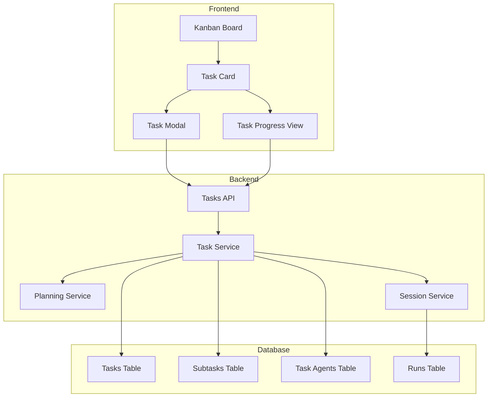

# Tasks Feature - Phased Implementation Plan

## Overview

The Tasks feature will provide a Kanban-style interface for creating, assigning, and tracking AI agent tasks. Tasks can optionally use a planning agent to decompose into subtasks, enabling multi-agent collaboration.

## Architecture Diagram



---

## Phase 1: Data Model & Backend Foundation

### Goal

Establish the database schema and core API endpoints for task management.

### Tasks

#### 1.1 Database Schema

- [ ] Create `tasks` table in [`packages/db/src/schema/`](packages/db/src/schema/)
  - `id`: UUID primary key
  - `title`: string
  - `description`: text (the prompt)
  - `status`: enum - backlog, todo, in_progress, review, done, cancelled
  - `priority`: enum - low, medium, high, urgent
  - `planning_enabled`: boolean
  - `planning_status`: enum - pending, in_progress, completed, failed
  - `created_at`, `updated_at`: timestamps
- [ ] Create `subtasks` table
  - `id`: UUID primary key
  - `task_id`: foreign key to tasks
  - `parent_subtask_id`: nullable self-reference for nested subtasks
  - `title`: string
  - `description`: text
  - `status`: enum - pending, assigned, in_progress, completed, failed
  - `assigned_agent_id`: string
  - `order_index`: integer
  - `result`: text nullable
  - `created_at`, `updated_at`: timestamps

- [ ] Create `task_agents` junction table
  - `task_id`: foreign key to tasks
  - `agent_id`: string
  - `role`: enum - primary, secondary, reviewer
  - `assigned_at`: timestamp

- [ ] Create Drizzle migrations
- [ ] Create repository layer in [`packages/db/src/repositories/`](packages/db/src/repositories/)

#### 1.2 API Routes

- [ ] Create [`apps/server/src/routes/tasks.ts`](apps/server/src/routes/tasks.ts)
  - `GET /tasks` - List all tasks with filtering
  - `POST /tasks` - Create task
  - `GET /tasks/:id` - Get task details
  - `PATCH /tasks/:id` - Update task
  - `DELETE /tasks/:id` - Delete task
  - `PATCH /tasks/:id/status` - Update task status
- [ ] Create [`apps/server/src/routes/subtasks.ts`](apps/server/src/routes/subtasks.ts)
  - `GET /tasks/:taskId/subtasks` - List subtasks
  - `POST /tasks/:taskId/subtasks` - Create subtask manually
  - `PATCH /subtasks/:id` - Update subtask
  - `PATCH /subtasks/:id/status` - Update subtask status

#### 1.3 Task Service

- [ ] Create [`apps/server/src/tasks/service.ts`](apps/server/src/tasks/service.ts)
  - `createTask(input)`
  - `updateTask(id, input)`
  - `deleteTask(id)`
  - `listTasks(filters)`
  - `getTask(id)`
  - `assignAgents(taskId, agentIds)`
  - `updateStatus(taskId, status)`

---

## Phase 2: Basic Kanban UI

### Goal

Create the Kanban board interface with drag-and-drop task management.

### Tasks

#### 2.1 Kanban Board Component

- [ ] Create [`apps/web/src/components/tasks/KanbanBoard.tsx`](apps/web/src/components/tasks/KanbanBoard.tsx)
  - Column layout for each status
  - Drag-and-drop using a library or native HTML5 DnD
  - Responsive design for mobile

- [ ] Create [`apps/web/src/components/tasks/KanbanColumn.tsx`](apps/web/src/components/tasks/KanbanColumn.tsx)
  - Column header with status name and count
  - Drop zone for cards
  - Add task button

- [ ] Create [`apps/web/src/components/tasks/TaskCard.tsx`](apps/web/src/components/tasks/TaskCard.tsx)
  - Display title, priority badge
  - Show assigned agents avatars
  - Progress indicator for subtasks
  - Click to open detail view

#### 2.2 Task CRUD Modals

- [ ] Create [`apps/web/src/components/tasks/TaskModal.tsx`](apps/web/src/components/tasks/TaskModal.tsx)
  - Title and description fields
  - Priority selector
  - Planning enabled toggle
  - Agent multi-select
  - Save/Cancel actions

- [ ] Create [`apps/web/src/components/tasks/TaskDetailPanel.tsx`](apps/web/src/components/tasks/TaskDetailPanel.tsx)
  - Full task view
  - Edit mode
  - Subtasks list
  - Activity log placeholder

#### 2.3 API Integration

- [ ] Create [`apps/web/src/lib/api-tasks.ts`](apps/web/src/lib/api-tasks.ts)
  - `fetchTasks()`
  - `createTask(input)`
  - `updateTask(id, input)`
  - `deleteTask(id)`
  - `updateTaskStatus(id, status)`

#### 2.4 Update TasksPage

- [ ] Replace placeholder in [`apps/web/src/components/pages/TasksPage.tsx`](apps/web/src/components/pages/TasksPage.tsx) with KanbanBoard

---

## Phase 3: Agent Assignment

### Goal

Enable assigning one or more agents to tasks with role designation.

### Tasks

#### 3.1 Agent Selection UI

- [ ] Create [`apps/web/src/components/tasks/AgentSelector.tsx`](apps/web/src/components/tasks/AgentSelector.tsx)
  - Multi-select dropdown
  - Show agent capabilities
  - Role assignment per agent

- [ ] Update TaskModal to include AgentSelector

#### 3.2 Backend Agent Integration

- [ ] Add `assignAgents(taskId, assignments)` to TaskService
- [ ] Validate agent exists in AgentRegistry
- [ ] Store assignments in task_agents table

#### 3.3 Display Assignments

- [ ] Update TaskCard to show assigned agents
- [ ] Add filter by assigned agent on KanbanBoard

---

## Phase 4: Task Execution

### Goal

Execute tasks by creating sessions linked to tasks and tracking agent progress.

### Tasks

#### 4.1 Task-to-Session Integration

- [ ] Add `task_id` column to sessions table or link via metadata
- [ ] Update SessionMessageService to accept optional taskId
- [ ] Create `executeTask(taskId)` method in TaskService
  - Creates a session for the task
  - Uses task description as initial prompt
  - Links session to task

#### 4.2 Execution UI

- [ ] Add Execute button to TaskDetailPanel
- [ ] Create [`apps/web/src/components/tasks/TaskExecutionView.tsx`](apps/web/src/components/tasks/TaskExecutionView.tsx)
  - Shows session messages
  - Real-time streaming
  - Status updates

#### 4.3 Status Synchronization

- [ ] Auto-update task status based on session/run status
- [ ] WebSocket events for task status changes

---

## Phase 5: Planning Mode

### Goal

Implement the planning agent that decomposes tasks into subtasks.

### Tasks

#### 5.1 Planning Agent Configuration

- [ ] Define planning agent in [`config/agents/`](config/agents/)
  - System prompt for task decomposition
  - Structured output format for subtasks

- [ ] Create [`apps/server/src/tasks/planning-service.ts`](apps/server/src/tasks/planning-service.ts)
  - `planTask(taskId)` - Invoke planning agent
  - Parse structured subtask output
  - Create subtask records
  - Assign agents to subtasks based on capabilities

#### 5.2 Planning Flow

- [ ] Add `POST /tasks/:id/plan` endpoint
- [ ] When planning_enabled is true on task creation:
  1. Create task with planning_status = pending
  2. Trigger planning agent
  3. Parse subtasks
  4. Assign to available agents
  5. Update planning_status = completed

#### 5.3 Planning UI

- [ ] Add Planning toggle to TaskModal
- [ ] Show planning progress indicator
- [ ] Display generated subtasks in TaskDetailPanel
- [ ] Allow manual subtask editing before confirmation

---

## Phase 6: Subtask Execution & Progress Tracking

### Goal

Execute subtasks in parallel and track overall task progress.

### Tasks

#### 6.1 Subtask Execution

- [ ] Create `executeSubtask(subtaskId)` method
  - Creates isolated session for subtask
  - Passes subtask description as prompt
  - Stores result in subtask.result

- [ ] Add `POST /subtasks/:id/execute` endpoint
- [ ] Add batch execution for all pending subtasks of a task

#### 6.2 Progress Tracking

- [ ] Create [`apps/web/src/components/tasks/TaskProgressBar.tsx`](apps/web/src/components/tasks/TaskProgressBar.tsx)
  - Visual progress bar
  - Subtask completion count
  - Status breakdown

- [ ] Add real-time progress updates via WebSocket
  - `task.progress` event
  - `subtask.started` event
  - `subtask.completed` event

#### 6.3 Dependency Management (Optional Enhancement)

- [ ] Add `depends_on` field to subtasks
- [ ] Execute subtasks in dependency order
- [ ] Visualize dependency graph

---

## Phase 7: Polish & Advanced Features

### Goal

Add quality-of-life features and refine the user experience.

### Tasks

#### 7.1 Filtering & Search

- [ ] Add search bar to KanbanBoard
- [ ] Filter by status, priority, assigned agent
- [ ] Sort by created date, priority, updated date

#### 7.2 Task Templates

- [ ] Create task templates for common workflows
- [ ] Template library UI
- [ ] Quick-create from template

#### 7.3 Activity Log

- [ ] Create `task_activities` table
- [ ] Log all task events
- [ ] Activity timeline in TaskDetailPanel

#### 7.4 Notifications

- [ ] In-app notifications for task events
- [ ] Browser notifications when subtasks complete

---

## Data Model Summary

```mermaid
erDiagram
    TASKS ||--o{ SUBTASKS : contains
    TASKS ||--o{ TASK_AGENTS : has
    SUBTASKS ||--o| AGENTS : assigned_to
    TASK_AGENTS ||--| AGENTS : references
    TASKS ||--o{ SESSIONS : linked_to
    SUBTASKS ||--o| SESSIONS : creates

    TASKS {
        uuid id PK
        string title
        text description
        enum status
        enum priority
        boolean planning_enabled
        enum planning_status
        timestamp created_at
        timestamp updated_at
    }

    SUBTASKS {
        uuid id PK
        uuid task_id FK
        uuid parent_subtask_id FK
        string title
        text description
        enum status
        string assigned_agent_id
        int order_index
        text result
        timestamp created_at
        timestamp updated_at
    }

    TASK_AGENTS {
        uuid task_id FK
        string agent_id
        enum role
        timestamp assigned_at
    }
```

---

## Implementation Order

| Phase                      | Priority | Dependencies |
| -------------------------- | -------- | ------------ |
| Phase 1: Data Model        | High     | None         |
| Phase 2: Kanban UI         | High     | Phase 1      |
| Phase 3: Agent Assignment  | High     | Phase 1, 2   |
| Phase 4: Task Execution    | Medium   | Phase 1, 3   |
| Phase 5: Planning Mode     | Medium   | Phase 4      |
| Phase 6: Progress Tracking | Medium   | Phase 5      |
| Phase 7: Polish            | Low      | Phase 6      |

---

## Questions for Clarification

1. **Planning Agent**: Should the planning agent be a specific pre-configured agent, or should users select which agent does the planning?

2. **Subtask Assignment**: When planning creates subtasks, should agents be auto-assigned based on capabilities/availability, or should the user manually assign them?

3. **Parallel Execution**: Should subtasks execute in parallel by default, or sequentially? Or should this be configurable per task?

4. **Task Result**: When a task completes, should there be an aggregated result/view that combines all subtask outputs?

5. **Permissions**: Should there be any permission controls on who can create/edit/execute tasks?
