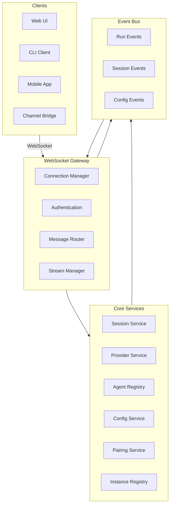
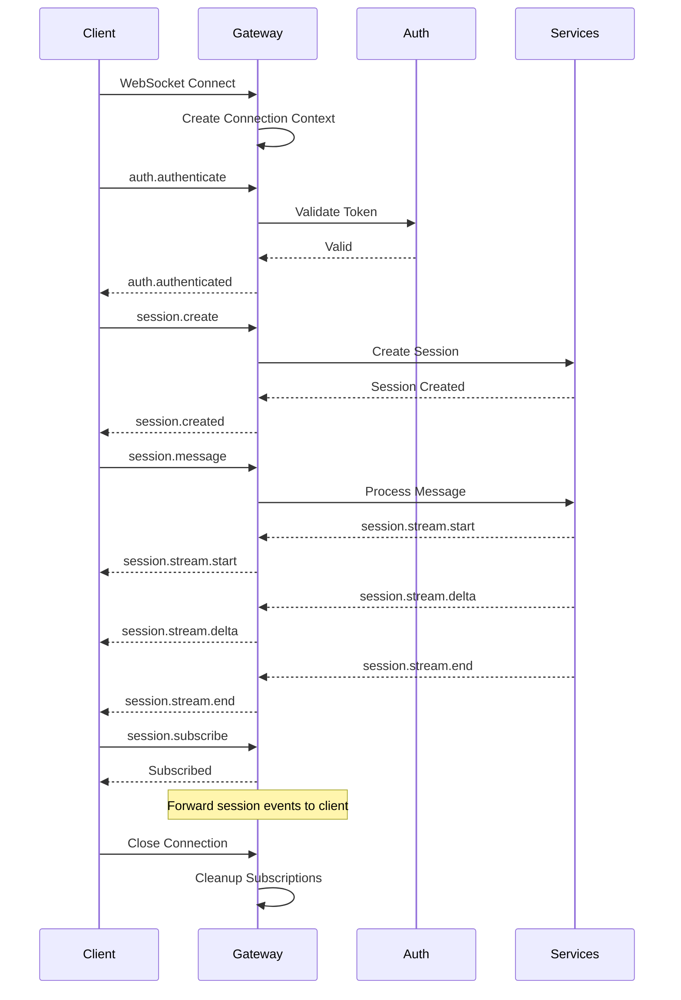
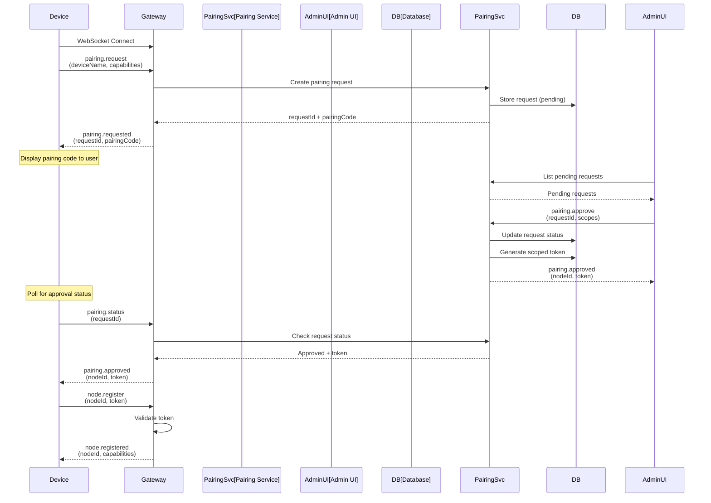

# WebSocket Control Plane Design

## Overview

OpenAidy will implement a WebSocket-based control plane similar to OpenClaw's Gateway. This control plane will serve as the central communication hub for all clients, enabling real-time bidirectional communication for sessions, streaming responses, device pairing, and configuration management.

## Goals

- Single WebSocket endpoint for all real-time communication
- Bidirectional message flow (client → server, server → client)
- Support for multiple client types (web UI, CLI, mobile apps, channel bridges)
- Device pairing and capability-based permissions
- Integration with existing session, provider, and agent services
- Backward compatibility with existing SSE streaming

## Architecture



## WebSocket Endpoint

- **Path**: `/ws`
- **Protocol**: WebSocket (wss:// for production, ws:// for development)
- **Port**: Configurable via `env.WS_PORT` (default: same as HTTP server)
- **Connection URL**: `ws://localhost:3000/ws` (or configured host)

## Message Protocol

### Message Envelope

All WebSocket messages follow this envelope structure:

```typescript
type WSMessage = {
  id: string; // Unique message ID (UUID)
  type: string; // Message type (e.g., "session.create")
  timestamp: string; // ISO 8601 timestamp
  payload: unknown; // Type-specific payload
  error?: WSError; // Present only for error responses
};
```

### Error Structure

```typescript
type WSError = {
  code: string; // Error code (e.g., "AUTH_FAILED", "INVALID_PAYLOAD")
  message: string; // Human-readable error message
  details?: Record<string, unknown>; // Additional error context
};
```

## Client → Server Messages (Requests)

### Authentication

#### `auth.authenticate`

Authenticate a client connection.

```typescript
type AuthAuthenticateRequest = {
  type: 'auth.authenticate';
  payload: {
    token?: string; // JWT or session token
    apiKey?: string; // API key for service-to-service
    credentials?: {
      type: 'pairing' | 'token' | 'api_key';
      data: Record<string, unknown>;
    };
  };
};
```

#### `auth.refresh`

Refresh an authentication token.

```typescript
type AuthRefreshRequest = {
  type: 'auth.refresh';
  payload: {
    refreshToken: string;
  };
};
```

### Session Management

#### `session.create`

Create a new session.

```typescript
type SessionCreateRequest = {
  type: 'session.create';
  payload: {
    agentId?: string; // Agent to use (defaults to default agent)
    providerId?: string; // Provider override
    modelId?: string; // Model override
    metadata?: Record<string, unknown>;
  };
};
```

#### `session.get`

Get session details.

```typescript
type SessionGetRequest = {
  type: 'session.get';
  payload: {
    sessionId: string;
  };
};
```

#### `session.list`

List sessions with optional filters.

```typescript
type SessionListRequest = {
  type: 'session.list';
  payload: {
    limit?: number;
    offset?: number;
    agentId?: string;
    status?: 'active' | 'archived' | 'all';
  };
};
```

#### `session.delete`

Delete a session.

```typescript
type SessionDeleteRequest = {
  type: 'session.delete';
  payload: {
    sessionId: string;
  };
};
```

#### `session.message`

Send a message to a session.

```typescript
type SessionMessageRequest = {
  type: 'session.message';
  payload: {
    sessionId: string;
    role: 'user' | 'system';
    content: string;
    stream?: boolean; // Enable streaming (default: true)
    metadata?: Record<string, unknown>;
  };
};
```

#### `session.subscribe`

Subscribe to session events.

```typescript
type SessionSubscribeRequest = {
  type: 'session.subscribe';
  payload: {
    sessionId: string;
    events?: string[]; // Event types to subscribe to (default: all)
  };
};
```

#### `session.unsubscribe`

Unsubscribe from session events.

```typescript
type SessionUnsubscribeRequest = {
  type: 'session.unsubscribe';
  payload: {
    sessionId: string;
  };
};
```

### Agent Management

#### `agent.list`

List available agents.

```typescript
type AgentListRequest = {
  type: 'agent.list';
  payload: {};
};
```

#### `agent.get`

Get agent details.

```typescript
type AgentGetRequest = {
  type: 'agent.get';
  payload: {
    agentId: string;
  };
};
```

### Provider Management

#### `provider.list`

List available providers.

```typescript
type ProviderListRequest = {
  type: 'provider.list';
  payload: {};
};
```

#### `provider.models`

List models for a provider.

```typescript
type ProviderModelsRequest = {
  type: 'provider.models';
  payload: {
    providerId: string;
  };
};
```

### Configuration

#### `config.get`

Get configuration.

```typescript
type ConfigGetRequest = {
  type: 'config.get';
  payload: {
    path?: string; // Optional path to specific config section
  };
};
```

#### `config.update`

Update configuration (requires admin permissions).

```typescript
type ConfigUpdateRequest = {
  type: 'config.update';
  payload: {
    updates: Record<string, unknown>;
  };
};
```

### Device/Node Management

#### `node.list`

List connected nodes/devices.

```typescript
type NodeListRequest = {
  type: 'node.list';
  payload: {};
};
```

#### `node.describe`

Get node capabilities and metadata.

```typescript
type NodeDescribeRequest = {
  type: 'node.describe';
  payload: {
    nodeId: string;
  };
};
```

#### `node.invoke`

Invoke a capability on a node.

```typescript
type NodeInvokeRequest = {
  type: 'node.invoke';
  payload: {
    nodeId: string;
    capability: string; // e.g., "camera.snap", "system.run"
    params: Record<string, unknown>;
  };
};
```

#### `node.register`

Register a new node (for device pairing).

```typescript
type NodeRegisterRequest = {
  type: 'node.register';
  payload: {
    nodeId: string;
    capabilities: string[];
    metadata?: Record<string, unknown>;
    pairingCode?: string; // For initial pairing
  };
};
```

### Pairing

#### `pairing.request`

Request device pairing.

```typescript
type PairingRequest = {
  type: 'pairing.request';
  payload: {
    deviceName: string;
    deviceType: 'mobile' | 'desktop' | 'browser' | 'channel';
    capabilities: string[];
  };
};
```

#### `pairing.approve`

Approve a pairing request.

```typescript
type PairingApproveRequest = {
  type: 'pairing.approve';
  payload: {
    requestId: string;
    scopes?: string[]; // Granted capability scopes
  };
};
```

#### `pairing.deny`

Deny a pairing request.

```typescript
type PairingDenyRequest = {
  type: 'pairing.deny';
  payload: {
    requestId: string;
  };
};
```

### Presence

#### `presence.update`

Update client presence status.

```typescript
type PresenceUpdateRequest = {
  type: 'presence.update';
  payload: {
    status: 'online' | 'away' | 'busy' | 'offline';
    metadata?: Record<string, unknown>;
  };
};
```

## Server → Client Messages (Responses & Events)

### Authentication Responses

#### `auth.authenticated`

Successful authentication response.

```typescript
type AuthAuthenticatedResponse = {
  type: 'auth.authenticated';
  payload: {
    clientId: string;
    token: string;
    expiresAt: string;
    capabilities: string[];
  };
};
```

### Session Responses

#### `session.created`

Session created response.

```typescript
type SessionCreatedResponse = {
  type: 'session.created';
  payload: {
    sessionId: string;
    agentId: string;
    createdAt: string;
  };
};
```

#### `session.message`

Message response (non-streaming).

```typescript
type SessionMessageResponse = {
  type: 'session.message';
  payload: {
    sessionId: string;
    messageId: string;
    role: 'assistant' | 'user' | 'system';
    content: string;
    usage?: {
      promptTokens: number;
      completionTokens: number;
      totalTokens: number;
    };
    finishReason?: string;
  };
};
```

#### `session.stream.start`

Start of streaming response.

```typescript
type SessionStreamStart = {
  type: 'session.stream.start';
  payload: {
    sessionId: string;
    runId: string;
    agentId: string;
    providerId: string;
    modelId: string;
  };
};
```

#### `session.stream.delta`

Streaming content delta.

```typescript
type SessionStreamDelta = {
  type: 'session.stream.delta';
  payload: {
    sessionId: string;
    runId: string;
    delta: string;
    content: string; // Full content so far
  };
};
```

#### `session.stream.tool_call`

Tool call during streaming.

```typescript
type SessionStreamToolCall = {
  type: 'session.stream.tool_call';
  payload: {
    sessionId: string;
    runId: string;
    toolCall: {
      id: string;
      name: string;
      arguments: Record<string, unknown>;
    };
  };
};
```

#### `session.stream.usage`

Usage information (end of stream).

```typescript
type SessionStreamUsage = {
  type: 'session.stream.usage';
  payload: {
    sessionId: string;
    runId: string;
    usage: {
      promptTokens: number;
      completionTokens: number;
      totalTokens: number;
    };
  };
};
```

#### `session.stream.end`

End of streaming response.

```typescript
type SessionStreamEnd = {
  type: 'session.stream.end';
  payload: {
    sessionId: string;
    runId: string;
    finishReason: string;
  };
};
```

#### `session.stream.error`

Streaming error.

```typescript
type SessionStreamError = {
  type: 'session.stream.error';
  payload: {
    sessionId: string;
    runId: string;
    error: {
      code: string;
      message: string;
    };
  };
};
```

### Agent Responses

#### `agent.list`

List of agents response.

```typescript
type AgentListResponse = {
  type: 'agent.list';
  payload: {
    agents: Array<{
      id: string;
      name: string;
      description?: string;
      capabilities: string[];
    }>;
  };
};
```

### Provider Responses

#### `provider.list`

List of providers response.

```typescript
type ProviderListResponse = {
  type: 'provider.list';
  payload: {
    providers: Array<{
      id: string;
      name: string;
      vendorFamily: string;
      capabilities: string[];
    }>;
  };
};
```

### Node/Device Events

#### `node.registered`

Node successfully registered.

```typescript
type NodeRegisteredResponse = {
  type: 'node.registered';
  payload: {
    nodeId: string;
    token: string;
    expiresAt: string;
  };
};
```

#### `node.invoked`

Result of node invocation.

```typescript
type NodeInvokedResponse = {
  type: 'node.invoked';
  payload: {
    nodeId: string;
    capability: string;
    result: unknown;
    error?: WSError;
  };
};
```

#### `node.online`

Node came online.

```typescript
type NodeOnlineEvent = {
  type: 'node.online';
  payload: {
    nodeId: string;
    capabilities: string[];
    metadata?: Record<string, unknown>;
  };
};
```

#### `node.offline`

Node went offline.

```typescript
type NodeOfflineEvent = {
  type: 'node.offline';
  payload: {
    nodeId: string;
  };
};
```

### Pairing Events

#### `pairing.requested`

New pairing request received.

```typescript
type PairingRequestedEvent = {
  type: 'pairing.requested';
  payload: {
    requestId: string;
    deviceName: string;
    deviceType: string;
    capabilities: string[];
    requestedAt: string;
  };
};
```

#### `pairing.approved`

Pairing approved.

```typescript
type PairingApprovedResponse = {
  type: 'pairing.approved';
  payload: {
    requestId: string;
    nodeId: string;
    token: string;
  };
};
```

### Configuration Events

#### `config.updated`

Configuration updated.

```typescript
type ConfigUpdatedEvent = {
  type: 'config.updated';
  payload: {
    updates: Record<string, unknown>;
    updatedAt: string;
  };
};
```

### Presence Events

#### `presence.changed`

Presence status changed.

```typescript
type PresenceChangedEvent = {
  type: 'presence.changed';
  payload: {
    clientId: string;
    status: string;
    metadata?: Record<string, unknown>;
  };
};
```

### Error Response

#### `error`

Generic error response.

```typescript
type ErrorResponse = {
  type: 'error';
  payload: {
    requestId: string; // ID of the request that failed
    error: WSError;
  };
};
```

## Connection Lifecycle



## Connection Manager

The Connection Manager is responsible for:

1. **Connection Lifecycle**
   - Accept new WebSocket connections
   - Track active connections with metadata
   - Handle connection close and cleanup
   - Implement heartbeat/ping-pong

2. **Authentication**
   - Validate authentication tokens
   - Associate connections with client identities
   - Track client capabilities and permissions

3. **Message Routing**
   - Route incoming messages to appropriate handlers
   - Broadcast events to subscribed clients
   - Implement request-response correlation

4. **Subscription Management**
   - Track client subscriptions (sessions, events)
   - Efficiently route events to subscribers
   - Handle subscription lifecycle

5. **Rate Limiting & Throttling**
   - Per-connection rate limits
   - Global rate limits
   - Backpressure handling

## Integration with Existing Services

### Session Service Integration

The WebSocket gateway will integrate with the existing [`SessionMessageService`](apps/server/src/sessions/service.ts):

- Use `sessionService.submitMessage()` for handling messages
- Subscribe to `runEvents` for streaming responses
- Map `RunEvent` types to WebSocket event types

### Provider Service Integration

- Use [`ProviderServices`](apps/server/src/providers/index.ts) for model invocation
- Map provider capabilities to client capabilities
- Expose provider/model information via WebSocket

### Agent Registry Integration

- Use [`AgentRegistry`](apps/server/src/agents/registry.ts) for agent management
- Route messages to appropriate agents
- Expose agent capabilities to clients

### Event Bus Integration

The WebSocket gateway will subscribe to the existing event bus:

- `session.created` → Broadcast to subscribed clients
- `session.message.appended` → Broadcast to session subscribers
- `run.*` events → Forward to session subscribers
- `config.updated` → Broadcast to admin clients

## Security Model

### Authentication

1. **Token-based authentication**
   - JWT tokens for web UI and mobile apps
   - API keys for service-to-service communication
   - Pairing tokens for device registration

2. **Capability-based authorization**
   - Each connection has a set of granted capabilities
   - Requests are validated against capabilities
   - Capability examples:
     - `sessions.read`
     - `sessions.write`
     - `sessions.stream`
     - `config.read`
     - `config.write`
     - `node.invoke`
     - `pairing.approve`

### Device Pairing

Device pairing establishes trust between the server and connected runtimes or operator devices. It follows a capability-based security model where devices declare what they can do, and admins grant specific scopes.

#### Pairing Flow



#### Detailed Pairing Steps

1. **Initiation**
   - Device connects via WebSocket to `/ws`
   - Device sends `pairing.request` with:
     - `deviceName`: Human-readable name (e.g., "John's iPhone")
     - `deviceType`: One of `mobile`, `desktop`, `browser`, `channel`
     - `capabilities`: Array of capabilities device supports
     - `metadata`: Optional device info (OS, version, etc.)

2. **Request Creation**
   - Server creates a pairing request with:
     - Unique `requestId` (UUID)
     - 6-digit alphanumeric `pairingCode` (e.g., "ABC123")
     - Status: `pending`
     - Expiration: 5 minutes (configurable)
   - Request is stored in database for persistence

3. **Approval**
   - Admin UI polls for pending requests via REST API or WebSocket
   - Admin reviews device name, type, and requested capabilities
   - Admin can:
     - Approve with full requested capabilities
     - Approve with reduced capabilities (subset)
     - Deny the request
   - Approved requests generate a scoped JWT token

4. **Token Generation**
   - JWT token includes:
     - `nodeId`: Unique node identifier (UUID)
     - `scopes`: Array of granted capabilities
     - `exp`: Expiration timestamp (default: 30 days)
     - `iat`: Issued at timestamp
   - Token is signed with server's secret key
   - Token is stored in database for revocation tracking

5. **Device Registration**
   - Device polls for approval status using `pairing.status`
   - Once approved, device receives the token
   - Device sends `node.register` with the token
   - Server validates token and establishes node identity
   - Node is now fully connected and can invoke capabilities

#### Token Scopes

Capabilities are granular permissions that define what a node can do. Scopes are granted during pairing and enforced on every request.

##### Capability Categories

**Session Capabilities**

- `sessions.read`: Read session metadata and history
- `sessions.write`: Create and modify sessions
- `sessions.stream`: Receive streaming responses
- `sessions.delete`: Delete sessions

**Agent Capabilities**

- `agents.read`: List and query agents
- `agents.invoke`: Invoke agent operations

**Provider Capabilities**

- `providers.read`: List providers and models
- `providers.invoke`: Invoke provider models

**Node Capabilities**

- `node.invoke`: Invoke capabilities on other nodes
- `node.describe`: Query node capabilities and metadata

**Config Capabilities**

- `config.read`: Read configuration
- `config.write`: Modify configuration (admin only)

**Pairing Capabilities**

- `pairing.approve`: Approve pairing requests (admin only)
- `pairing.deny`: Deny pairing requests (admin only)

**System Capabilities**

- `system.run`: Execute system commands (requires elevated permission)
- `system.notify`: Send system notifications

##### Scope Examples

**Mobile Node (Limited)**

```typescript
const mobileNodeScopes = [
  'sessions.read',
  'sessions.write',
  'sessions.stream',
  'node.invoke', // Can invoke camera, location, etc.
];
```

**Desktop Node (Full)**

```typescript
const desktopNodeScopes = [
  'sessions.read',
  'sessions.write',
  'sessions.stream',
  'sessions.delete',
  'agents.read',
  'agents.invoke',
  'providers.read',
  'providers.invoke',
  'node.invoke',
  'node.describe',
  'config.read',
];
```

**Admin Client (Full + Admin)**

```typescript
const adminScopes = [
  '*', // Wildcard for all capabilities
  'config.write',
  'pairing.approve',
  'pairing.deny',
];
```

**Channel Bridge (Specific)**

```typescript
const channelScopes = [
  'sessions.read',
  'sessions.write',
  'sessions.stream',
  'agents.invoke',
  'providers.invoke',
];
```

#### Approval Process

The approval process can be handled through multiple interfaces:

1. **Admin Web UI**
   - Real-time list of pending requests
   - Device details display (name, type, capabilities)
   - One-click approve/deny buttons
   - Scope editor for custom capability grants

2. **CLI**

   ```bash
   # List pending requests
   openaidy pairing list

   # Approve a request
   openaidy pairing approve <requestId> --scopes "sessions.read,sessions.write"

   # Deny a request
   openaidy pairing deny <requestId>
   ```

3. **WebSocket Commands**
   - Admin clients can approve/deny via WebSocket
   - Real-time notifications of new requests

#### Pairing Request States

```typescript
type PairingRequestStatus = 'pending' | 'approved' | 'denied' | 'expired';

type PairingRequest = {
  requestId: string;
  pairingCode: string;
  deviceName: string;
  deviceType: 'mobile' | 'desktop' | 'browser' | 'channel';
  capabilities: string[];
  metadata?: Record<string, unknown>;
  status: PairingRequestStatus;
  requestedAt: string;
  expiresAt: string;
  approvedAt?: string;
  approvedBy?: string; // Admin user ID
  deniedAt?: string;
  deniedBy?: string;
  nodeId?: string; // Set when approved
  token?: string; // Set when approved
  scopes?: string[]; // Granted scopes (may differ from requested)
};
```

#### Token Management

**Token Rotation**

- Tokens have configurable expiration (default: 30 days)
- Devices can refresh tokens before expiration
- Refresh tokens (separate from access tokens) allow re-issuance
- Admin can force token rotation for security

**Token Revocation**

- Tokens can be revoked at any time by admin
- Revoked tokens are tracked in database
- Revoked tokens are rejected on validation
- Device receives `token.revoked` event and must re-pair

**Token Storage**

- Tokens are stored in database for validation and revocation
- Token hash is stored (not plaintext) for security
- Token metadata includes creation time, expiration, scopes

#### Security Considerations

1. **Pairing Code Security**
   - 6-digit codes provide ~2 billion combinations
   - Codes expire after 5 minutes
   - Limited attempts per IP address
   - Rate limiting on pairing requests

2. **Token Security**
   - JWT tokens signed with strong secret
   - Tokens include expiration and issued-at claims
   - Token validation on every request
   - Token revocation list checked

3. **Capability Enforcement**
   - Every request validated against token scopes
   - Scope checks happen before service invocation
   - Audit logging of all capability uses
   - Admin alerts for suspicious activity

4. **Device Fingerprinting**
   - Device metadata stored for audit
   - Optional device certificate validation
   - IP address tracking for anomaly detection

#### Pairing Configuration

```typescript
type PairingConfig = {
  // Request settings
  codeLength: number; // Default: 6
  codeExpiryMs: number; // Default: 300000 (5 minutes)
  maxPendingRequests: number; // Default: 100

  // Token settings
  defaultTokenExpiryMs: number; // Default: 2592000000 (30 days)
  maxTokenExpiryMs: number; // Default: 7776000000 (90 days)
  refreshTokenExpiryMs: number; // Default: 7776000000 (90 days)

  // Security settings
  maxAttemptsPerIp: number; // Default: 10
  attemptWindowMs: number; // Default: 3600000 (1 hour)
  requireAdminApproval: boolean; // Default: true

  // Auto-approval (optional)
  autoApproveDomains?: string[]; // Whitelisted domains
  autoApproveCapabilities?: string[]; // Auto-approve these capabilities
};
```

### Rate Limiting

- Per-connection message rate limit
- Per-client connection limit
- Global rate limit for DoS protection

## Configuration

### Environment Variables

```typescript
// WebSocket configuration
WS_ENABLED: boolean = true;
WS_PORT: number = 3000; // Same as HTTP server
WS_PATH: string = '/ws';
WS_MAX_CONNECTIONS: number = 1000;
WS_HEARTBEAT_INTERVAL: number = 30000; // 30 seconds

// Authentication
WS_AUTH_REQUIRED: boolean = true;
WS_TOKEN_EXPIRY: number = 86400000; // 24 hours

// Rate limiting
WS_RATE_LIMIT_MAX: number = 100; // Messages per minute
WS_RATE_LIMIT_WINDOW: number = 60000; // 1 minute
```

### Runtime Configuration

```typescript
type WebSocketConfig = {
  enabled: boolean;
  port: number;
  path: string;
  maxConnections: number;
  heartbeatInterval: number;
  auth: {
    required: boolean;
    tokenExpiry: number;
  };
  rateLimit: {
    max: number;
    window: number;
  };
};
```

## Implementation Plan

### Phase 1: Core WebSocket Infrastructure

1. Create WebSocket gateway plugin
2. Implement connection manager
3. Implement message router
4. Add authentication middleware
5. Add basic error handling

### Phase 2: Session Integration

1. Implement session management endpoints
2. Integrate with SessionMessageService
3. Implement streaming responses
4. Add subscription management

### Phase 3: Agent & Provider Integration

1. Implement agent list/get endpoints
2. Implement provider list/models endpoints
3. Integrate with AgentRegistry
4. Integrate with ProviderServices

### Phase 4: Device/Node Support

1. Implement node registration
2. Implement node invocation
3. Add capability system
4. Implement pairing flow

### Phase 5: Configuration & Presence

1. Implement config get/update endpoints
2. Implement presence system
3. Add configuration change events
4. Add presence change events

### Phase 6: Testing & Documentation

1. Write unit tests for all components
2. Write integration tests
3. Create client SDK documentation
4. Create protocol documentation

## File Structure

```
apps/server/src/
├── websocket/
│   ├── index.ts              # Gateway plugin entry point
│   ├── connection-manager.ts # Connection lifecycle
│   ├── message-router.ts     # Message routing
│   ├── handlers/             # Request handlers
│   │   ├── auth.ts
│   │   ├── session.ts
│   │   ├── agent.ts
│   │   ├── provider.ts
│   │   ├── config.ts
│   │   ├── node.ts
│   │   └── pairing.ts
│   ├── events.ts             # WebSocket event types
│   ├── types.ts              # Shared types
│   └── middleware/
│       ├── auth.ts
│       └── rate-limit.ts
packages/shared-types/src/
└── websocket.ts              # Shared WebSocket types for clients
packages/sdk/src/
└── websocket-client.ts       # Client SDK for WebSocket
```

## Backward Compatibility

The WebSocket gateway will coexist with the existing SSE streaming:

- SSE endpoints (`/api/runs/:id/stream`) remain for existing clients
- WebSocket provides enhanced capabilities (subscriptions, bidirectional)
- Clients can choose between SSE and WebSocket based on needs
- Migration path documented for existing clients

## Future Enhancements

1. **Channel Plugins**
   - Channel plugins can connect via WebSocket
   - Real-time message delivery to channels
   - Channel-specific event routing

2. **MCP Integration**
   - MCP servers can connect via WebSocket
   - Real-time tool invocation
   - Resource streaming

3. **Canvas/A2UI Support**
   - Canvas rendering via WebSocket
   - Real-time UI updates
   - Interactive canvas controls

4. **Multi-Server Support**
   - WebSocket connection pooling
   - Load balancing across servers
   - Cross-server event broadcasting
